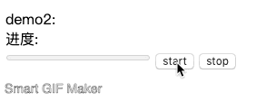

# promise-loops

这是一个可以用来循环执行promise的工具
</br></br>
```bash
npm install --save promise-loops
```

# Demo
比如每隔X秒输出一个数, 可以随时终止, 随时开始</br>

```js
let index = 0;
const addPromise = (params) => (
  // 可以接收参数
	new Promise((res) => {
		// console.log(++index)
		res(index++);
	})
)

const loop = new LoopPromise(addPromise);
loop
	.time(1000) // 每隔1秒触发一次
	.interruptTime((res) => (res !== 10), true) // 当第一个参数返回true时就会一直运行直到返回false, 也可以直接设置成number类型表示执行次数, 第二个参数可选, true表示当暂停时也触发callback
	.params(() => ('params')) // 可以设置参数
	.filterRes(res => res) // 统一处理resolved值
	.callback(res => { oDiv.innerHTML = `${oDiv.innerHTML} ${res}` }) // 回调

loop.trim(); // 开始轮询promise

```
</br>
</br>

比如通过接口获取进度条的进度之类, 可以随时暂停, 随时开始</br>


```js
import LoopPromise from '../src';
import ajaxFetchProcess from './fakeProcess';

const fetchOriginData = () => (
  new Promise((resolved) => {
    const result = ajaxFetchProcess();
    resolved(result);
  })
);

const loop = new LoopPromise(fetchOriginData);

loop
  .time(2000)
  .interruptTime(res => res !== 100)
  .callback(res => (oProgress1.innerHTML = `进度: ${res}%`) && oProgress2.setAttribute('value', res))

```

