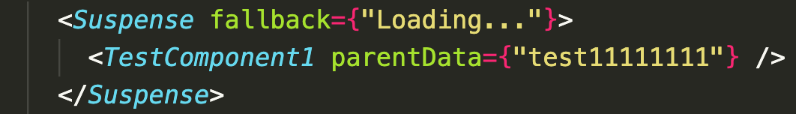
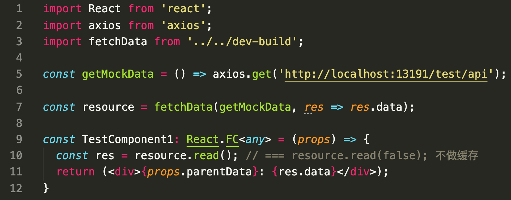

# react-suspense-cache
---
> 该工具类需要配合 react 的 suspense功能使用

&emsp;&emsp;react16.8之后内置提供了 suspense 功能, 该 API 可以在 render 阶段以同步的方式优雅地执行副作用. 
</br> &emsp;&emsp;但使用 suspense 需要显示地 throw Promise, 同时需要手动的对请求值做缓存.
</br> &emsp;&emsp;使用 react-suspense-cache 可以方便的与 suspense 进行配合, 同时提供缓存功能.

---

## 简单使用
> * 父组件中


> * 子组件中



---
Demo实例
```bash
  git clone git@github.com:y805939188/personal-common-tool-and-components.git && cd /personal-common-tool-and-components/utils/react-suspense-cache
```
```bash
  npm install
```
```bash
  npm run start
```
---
* 该工具使用 shin-cli 创建
